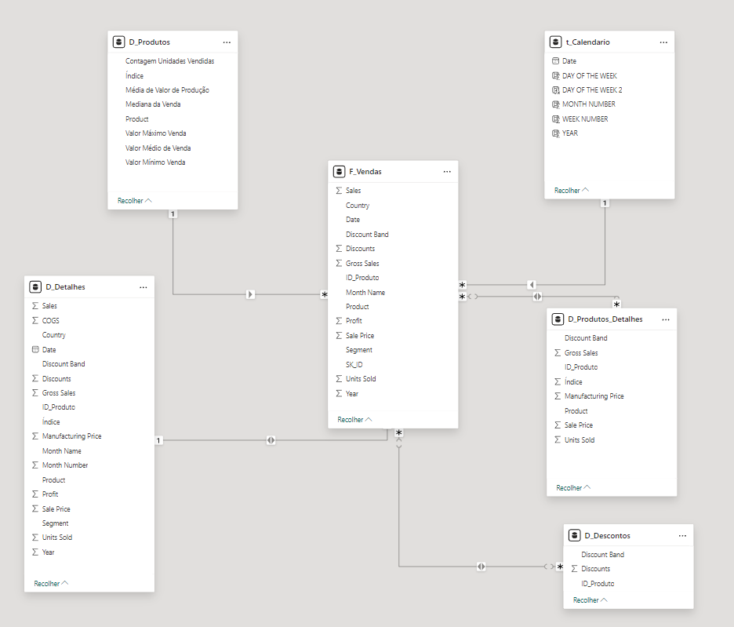

### Relacionamentos

O Star Schema foi baseado na tabela Fato de Vendas. 

As relações foram criadas através do ID_Produto, que implicou em algumas relações de muitos para muitos.
Os detalhes foram relacionados através do Índice e da chave artificial SK

